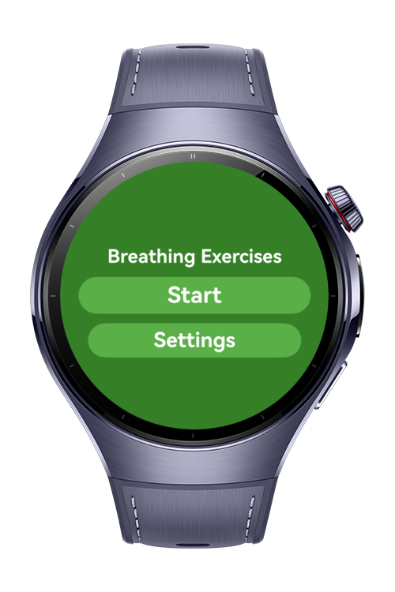
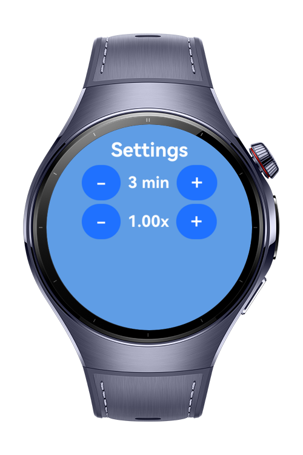
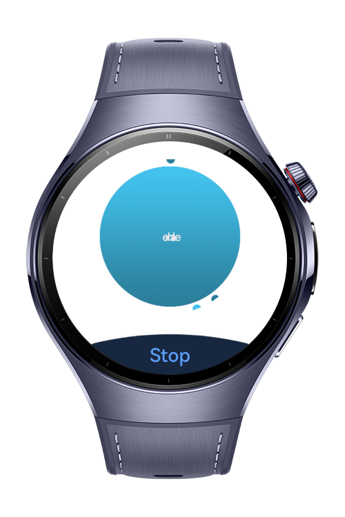

> **Note:** To access all shared projects, get information about environment setup, and view other guides, please visit [Explore-In-HMOS-Wearable Index](https://github.com/Explore-In-HMOS-Wearable/hmos-index).

# Breathing Exercises

This app guides you through quick and powerful breathing exercises that eliminate stress & anxiety, increase energy, improve endurance, and help you fall asleep.

# Preview

<div>
  
  
  
</div>

# Use Cases

- Inhale/Exhale timer
- Inhale/Exhale speed

# Tech Stack

- **Languages**: ArkTS, ArkUI
- **Frameworks**: HarmonyOS SDK 5.1.0(18)
- **Tools**: DevEco Studio Version 5.1.1.823
- **Libraries**:
    - `@kit.ArkUI`
    - `@kit.ArkTS`
    - `lottie`

# Directory Structure

```
entry/src/main/ets/
├───animation
│       Breath.json
├───entryability
│       EntryAbility.ets
├───entrybackupability
│       EntryBackupAbility.ets
├───modifier
│       TextModifier.ets
├───pages
│       Index.ets
│       Main.ets
│       Settings.ets
```

# Constraints and Restrictions

## Supported Device

* Huawei Watch 5

# License

**Breathing Exercises** is distributed under the terms of the MIT License
See the [LICENSE](./LICENSE) for more information.